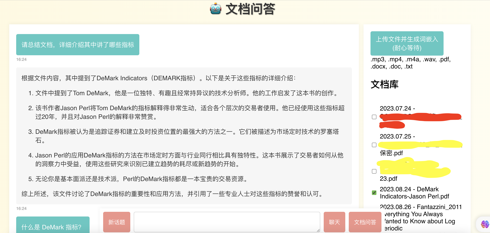

# 想法

- 主要用来问答 pdf 和 mp3 文件
- 语音转文本使用 openai 的服务
- 流式输出
- 问答时可指定页面进行提问
- 除了问答，还支持总结和普通聊天


## 前端 React

```
    npx create-react-app chatbot-pdf
    npm install axios react react-markdown
    npm install react-syntax-highlighter
    npm install react-router-dom
```

- 前端提供上传、选择文档、提问、聊天功能
- 支持 .mp3, .mp4, .m4a, .wav, .pdf, .docx, .doc, .txt
- 可选择多个文档提一个问题

## 后端 FastApi

- 使用自己的 PDF 解析工具, 支持中文扫描版 pdf, 已分离到另一个服务
- 只使用了 langchain 的 text_splitter 和 Document, 可随时去掉 langchain 依赖
- 解析成 txt 之后使用 chromaDB 进行存储
- 由前置 llm 判断是否总结型问题
    - 如果是，传入整个文档做总结
    - 否则向量相似性搜索，并传送更多相关内容给 gpt
    - 当搜索结果不匹配问题时，传入整个文档进行问答


